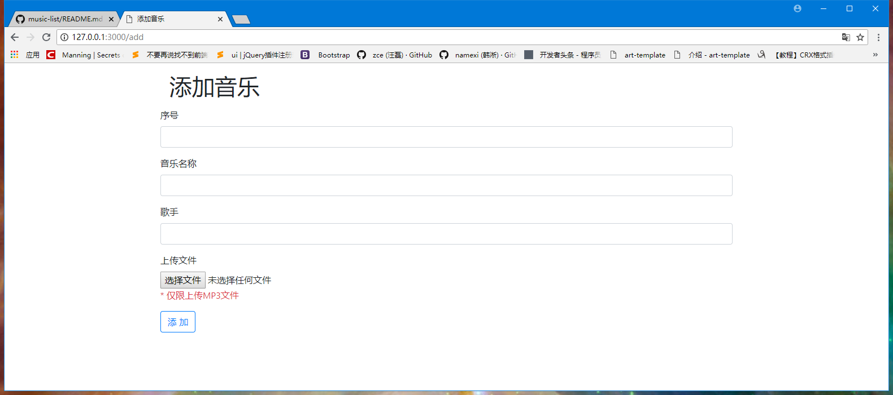

# music-List

### 项目初始化


+ 安装 package.json

```
npm init -y
```

  

### 搭建项目架构

```
└── music-List ······································ 项目文件夹（网站根目录）
    ├── node_modules ··································· 依赖文件夹
    ├── public ·································· 静态文件夹
    │   ├── css ······························ 资源文件夹
    │   └── uploads ····························· 上传文件夹
    └── index.html ······························· 前台脚本文件
    └── add.html ······························· 前台脚本文件
    └── package.json ······························· 依赖说明文件
    └── index.js ······························· 服务器脚本文件
```


### 配置路由

+ 配置静态路由

  [🚩 源代码: step-03](https://github.com/namexi/music-list/commit/85be7c29e081eb9f8a106797e44dc5a1228ca109)

+ 主页路由

  ```
  url:127.0.0.1:3000
  ```

  ​

  

   

  - 解决浏览器 .ico  bug

``` Javascript
  ​!pathUrl.includes('favicon.ico')
```


+ 添加路由

  ```
  url:127.0.0.1:3000/add
  ```

  